# IBM Client Developer Advocacy App Modernization Series

## Lab - Migrating Legacy JEE apps to OpenShift in a multi-user lab environment

### Working with Templates

## Overview

OpenShift Templates provide a parameterized set of objects that can be processed by OpenShift. Templates enable developers to create repeatable parameterized deployments that minimize mistakes due to user error.

In this lab you'll use these  capabilities can be used to deploy a small legacy  Java EE app to OpenShift in a multi-user OpenShift environment

### Step 1: Logon into the OpenShift Web Console and to the OpenShift CLI

1.1 login into the OpenShift web console using the user credentials provided to you

1.2 From the OpenShift web console click on your username in the upper right and select **Copy Login Command**

   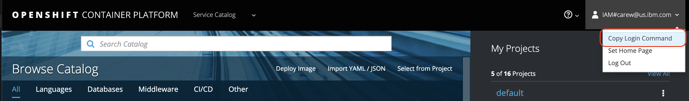

1.3 Paste the login command in a terminal window and run it (Note: leave the web console browser tab open as you'll need it later on in the lab)

### Step 2: Pull the Websphere Liberty base image from Docker Hub and push it to the OpenShift internal registry

2.1 Get the hostname of your OpenShift internal registry so you can push images to it

   ```bash
   export INTERNAL_REG_HOST=`oc get route docker-registry --template='{{ .spec.host }}' -n default`
   ```
2.2 Create a new OpenShift project for this lab

   ```bash
   oc new-project pbw-liberty-mariadb
   ```

2.3 Tag the Websphere Liberty base image from Docker Hub appropriately for the internal registry

   ```bash
   docker tag websphere-liberty:javaee7  $INTERNAL_REG_HOST/`oc project -q`/websphere-liberty:javaee7
   ```

2.4 Login to the internal registry

   ```bash
   docker login -u `oc whoami` -p `oc whoami -t` $INTERNAL_REG_HOST
   ```
2.5 Push the Websphere Liberty base image to the internal registry

   ```bash
    docker push $INTERNAL_REG_HOST/`oc project -q`/websphere-liberty:javaee7
   ```

### Step 3: Install MariaDB from the OpenShift template catalog

3.1 In your Web console browser tab under **My Projects** click on **View All**

   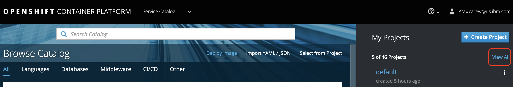

3.2 Click on your project e.g. **pbw-user012**

3.3 Click on **Browse Catalog**

3.4 Select the **Databases** category, click **MariaDB** and then **MariaDB (Ephemeral)**

   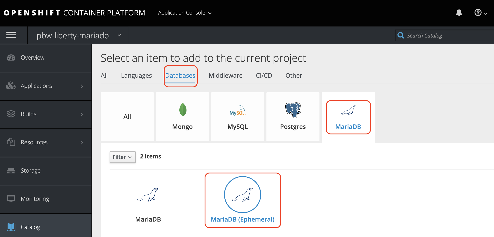

3.5 Click **Next**

3.6 Enter the following values for the fields indicated below (leave remaining values at their default values)

| Field name | Value |
| ---------- | ----- |
| MariaDB Connection Username | `pbwadmin` |
| MariaDB Connection Password | `l1bertyR0cks` |
| MariaDB Database Name | `plantsdb`|

  When you're done the dialog should look like the following:

   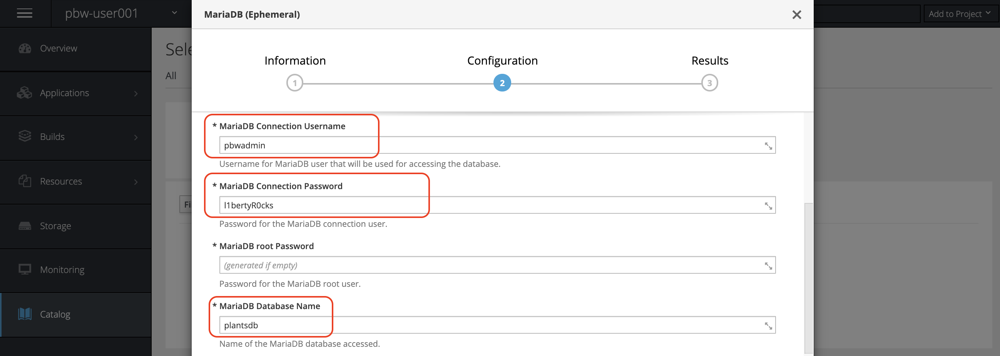

3.7 Scroll down to the **Labels** section and change the **app** label value to `pbw-liberty-mariadb`

   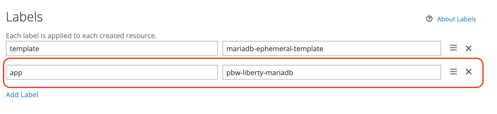

3.8 Click **Next**

3.9 Under **Create a binding for MariaDB (Ephemeral)** select **Create a secret in pbw-usernnn to be used later**

3.10 Click **Create** and then click **Continue to the project overview**

   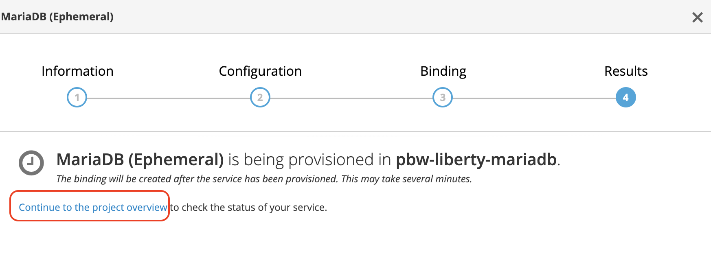

3.11 Verify that the Pod for the MariaDB deployment eventually shows as running

   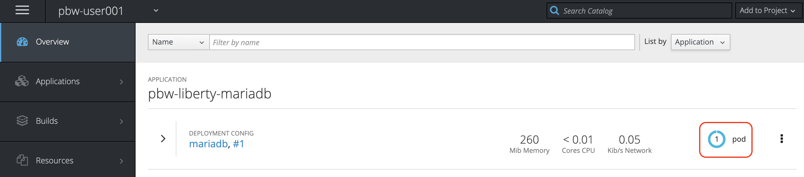


### Step 4: Clone the Github repo that contains the code for the Plants by WebSphere app

4.1  Login in [your Github account](https://github.com)

4.2  In the search bar at the top left type in `app-modernization-plants-by-websphere-jee6`

  

4.3  Select the repository `IBMAppModernization\app-modernization-plants-by-websphere-jee6` and then click on the **Fork** icon

4.4  Click the **Clone or download** button from your copy of the forked repo and copy the HTTPS URL to your clipboard

  

4.5 From your terminal go back to your home directory

   ```text
   cd ~
   ```
4.6  From the client terminal window clone the Git repo  with  the following commands  appending the HTTPS URL from your clipboard

   ```text
   git clone [HTTPS URL for NEW REPO]
   cd app-modernization-plants-by-websphere-jee6
   ```

### Step 5: Install the Plants by WebSphere Liberty app using a template that utilizes S2I to build the app image   

5.1 Add the Plants by WebSphere Liberty app template to your OpenShift cluster

   ```bash
   oc create -f openshift/templates/docker/pbw-liberty-template.yaml
   ```
5.2 In your Web console browser tab make sure you're in the **pbw-usernnn** project (top left) and click on **Add to Project -> Browse Catalog** (top right)

   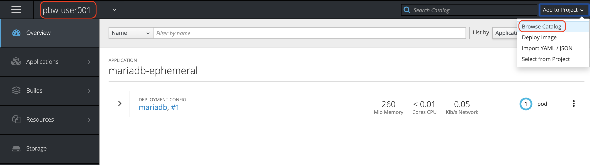

5.3 Select the **Other** category and then click **Plants by WebSphere on Liberty**

5.4 Enter the URL of your clone of the Plants by WebSphere Github repository

   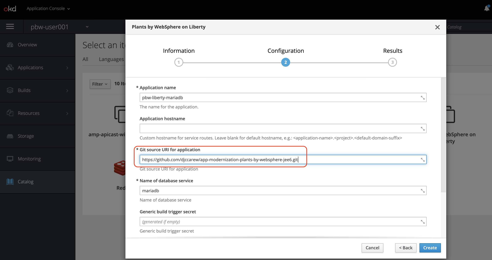

5.5 Accept all the other default values and click **Create**

5.6 Click  **Continue to the project overview**

5.7 Wait until the Pod for the Plants by WebSphere app on Liberty shows as running and then click on the route to get to the app's endpoint

   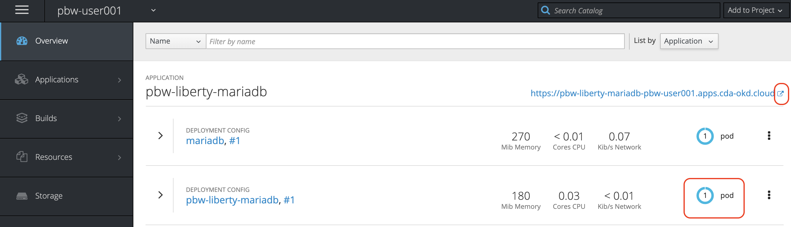

### Step 6: Test the Plants by WebSphere app

6.1 From the Plants by WebSphere app UI, click on the **HELP** link

   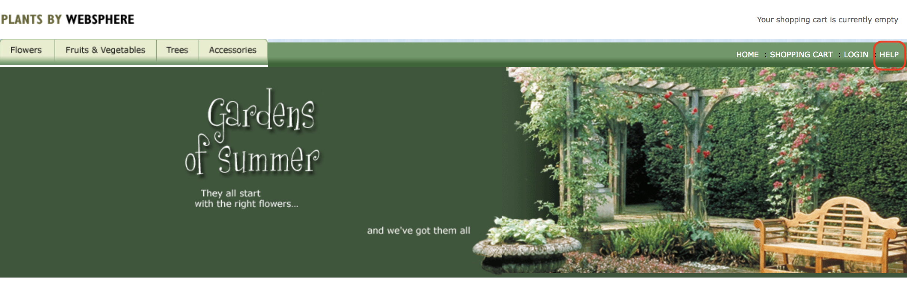

6.2. Click on **Reset database** to populate the MariaDB database with data

6.3. Verify that browsing different sections of the online catalog shows product descriptions and images.

   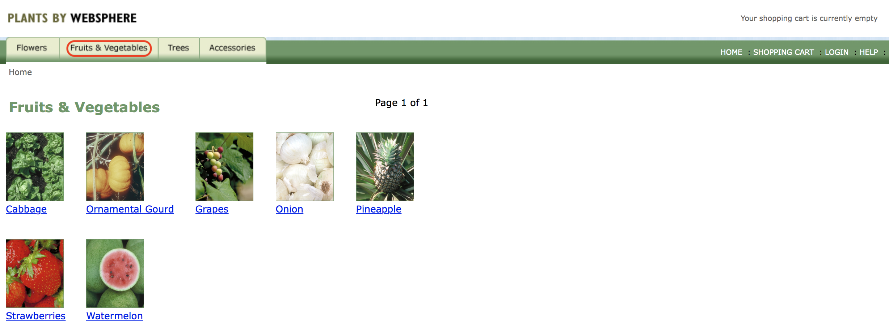

## Summary

With even small simple apps requiring multiple OpenShift  objects,  templates  greatly simplify the process of distributing OpenShift  apps. S2I allows you to reuse the  same builder image for apps on the same app server, avoiding  the effort of having to create unique images for each app.
